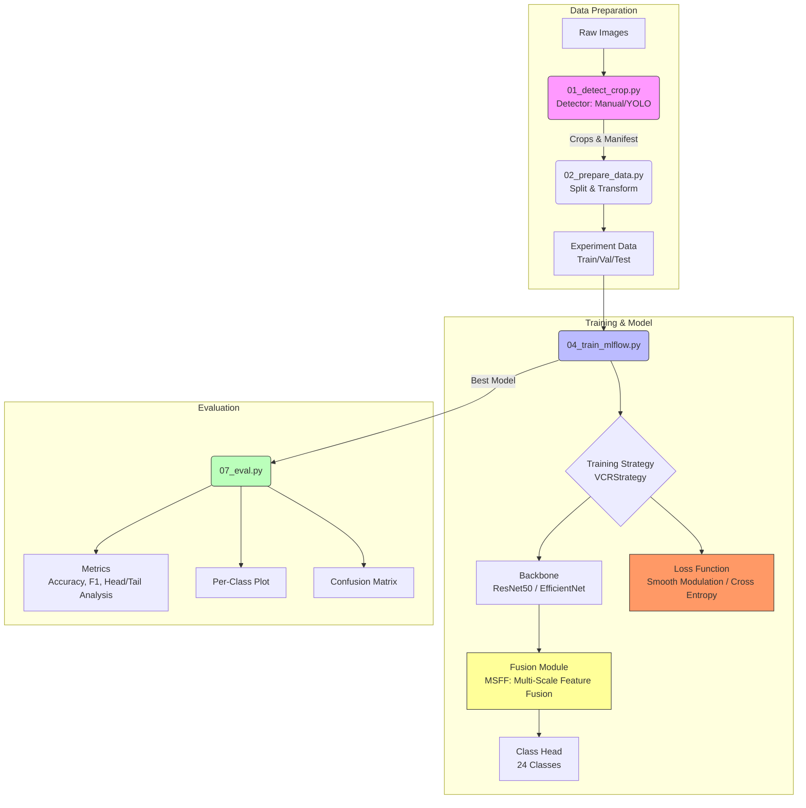

# VCR (Vehicle Color Recognition) - Pipeline & Architecture

This document outlines the implemented pipeline and architecture for the VCR project, based on the **Classificador CNN Multi-escala com Modulação para Long-Tail** specification.

## 📐 Architecture Diagram

The system implements a multi-stage pipeline from data ingestion to evaluation, featuring a modular CNN with multi-scale fusion.

## 🚀 Pipeline Steps

The pipeline is automated via numbered Python scripts:

1.  **Detection & Cropping (`01_detect_crop.py`)**
    *   **Input**: Raw images and annotations (JSON).
    *   **Process**: Detects vehicles using manual annotations (for color ground truth) or YOLO. Crops vehicle instances.
    *   **Output**: `manifest_raw.jsonl` and cropped images.

2.  **Data Preparation (`02_prepare_data.py`)**
    *   **Input**: `manifest_raw.jsonl`.
    *   **Process**: Splits data (Train/Val/Test), balances datasets if configured, and locks configuration (seed, transforms) for reproducibility.
    *   **Output**: Experiment-specific manifests and config.

3.  **Model Definition (`04_model.py`)**
    *   **Architecture**:
        *   **Backbone**: Configurable (Default: ResNet50, supports EfficientNet).
        *   **Fusion**: Multi-Scale Feature Fusion (MSFF) effectively concatenates features from different depths to capture both color texture and global context.
        *   **Head**: Linear projection to $N$ classes (e.g., 24 colors).

4.  **Training (`05_train_mlflow.py`)**
    *   **Process**: Trains the model using MLflow for tracking.
    *   **Strategy**: Uses `VCRStrategy` to manage the training loop.
    *   **Optimization**: Supports `WeightedRandomSampler` and `Smooth Modulation Loss` (via strategy/loss factories) to handle long-tail class distribution.
    *   **Features**: Early stopping, auto-resume, checkpointing.

5.  **Inference (`05_infer.py`)**
    *   **Process**: Runs predictions on new images or test sets using trained checkpoints.

6.  **Evaluation (`07_eval.py`)**
    *   **Metrics**: Accuracy, Macro/Weighted F1, Precision/Recall per class.
    *   **Analysis**:
        *   **Confusion Matrix**: Visualizes misclassifications.
        *   **Head/Tail Analysis**: Specifically evaluates performance differences between frequent ("head") and rare ("tail") color classes to validate long-tail handling.

## 🏗️ Implemented Architecture Features

*   **Multi-Scale Feature Fusion (MSFF)**: Implemented to robustly identify colors by combining local details (reflections, edges) with global semantics.
*   **Long-Tail Handling**:
    *   **Data Level**: Weighted Random Sampling.
    *   **Loss Level**: Support for modulated losses (Smooth Modulation / Focal Loss) to prioritize rare classes.
*   **Modularity**: Factory patterns for Backbones, Fusion, and Losses allowing easy switching (e.g., ResNet vs EfficientNet) as proposed in the project variations.
