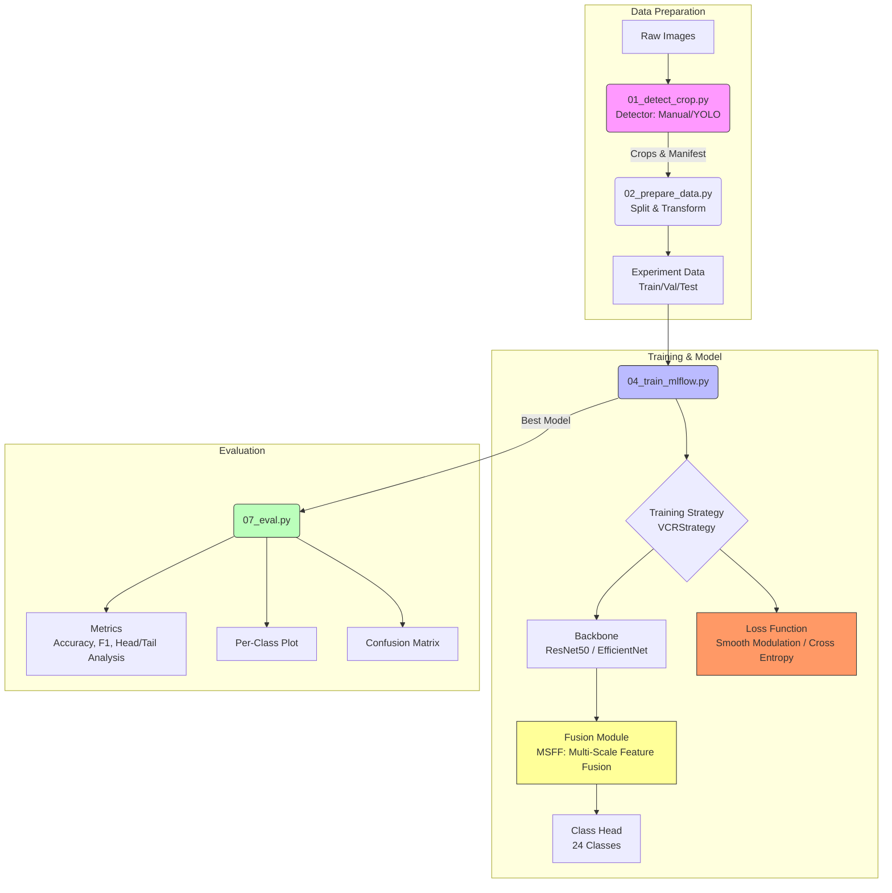

# VCR (Vehicle Color Recognition) - Pipeline & Architecture

This document outlines the implemented pipeline and architecture for the VCR project, based on the **Classificador CNN Multi-escala com Modulação para Long-Tail** specification.

## 📐 Architecture Diagram

The system implements a multi-stage pipeline from data ingestion to evaluation, featuring a modular CNN with multi-scale fusion.

## 🚀 Pipeline Steps

The pipeline is automated via numbered Python scripts:

1.  **Detection & Cropping (`01_detect_crop.py`)**
    - **Class**: `Step01DetectCrop` (implements `PipelineStep`)
    - **Input**: Raw images and annotations (JSON).
    - **Process**: Detects vehicles using manual annotations (for color ground truth) or YOLO. Crops vehicle instances.
    - **Output**: `manifest_raw.jsonl` and cropped images.

2.  **Data Preparation (`02_prepare_data.py`)**
    - **Class**: `Step02PrepareData` (implements `PipelineStep`)
    - **Input**: `manifest_raw.jsonl`.
    - **Process**: Splits data (Train/Val/Test), balances datasets if configured, and locks configuration (seed, transforms) for reproducibility.
    - **Output**: Experiment-specific manifests and config in `runs/{experiment}/data/`.

3.  **Preprocessing (`03_preprocess.py`)**
    - **Class**: `Step03Preprocess` (implements `PipelineStep`)
    - **Input**: `manifest_raw.jsonl` or `manifest_raw_labeled.jsonl`.
    - **Process**: Validates records, encodes labels, splits data.
    - **Output**: `manifest_ready.jsonl` and `class_to_idx.json`, `class_counts.json`.

4.  **Model Definition (`04_model.py`)**
    - **Class**: `Step04Model` (implements `PipelineStep`)
    - **Architecture**:
      - **Backbone**: Configurable (Default: ResNet50, supports EfficientNet).
      - **Fusion**: Multi-Scale Feature Fusion (MSFF).
      - **Head**: Linear projection to $N$ classes.

5.  **Optimization (`05_optimize.py`)**
    - **Class**: `Step05Optimize` (implements `PipelineStep`)
    - **Process**: Hyperparameter optimization with Optuna + MLflow.
    - **Config**: `hyperparameters.yaml` defines search space.
    - **Usage**: `python 05_optimize.py --experiment first_experiment --n-trials 10`

6.  **Training (`06_train_mlflow.py`)**
    - **Class**: `Step06TrainMlflow` (implements `PipelineStep`)
    - **Process**: Trains the model using `config.yaml` or best Optuna params.
    - **Features**: Early stopping, auto-resume, checkpointing.
    - **Usage**: `python 06_train_mlflow.py --experiment first_experiment`

7.  **Inference (`07_infer.py`)**
    - **Class**: `Step07Infer` (implements `PipelineStep`)
    - **Process**: Runs predictions on new images or test sets.
    - **Usage**: `python 07_infer.py --checkpoint runs/exp/train/best.pt --image img.jpg`

8.  **Evaluation (`08_eval.py`)**
    - **Class**: `Step08Eval` (implements `PipelineStep`)
    - **Metrics**: Accuracy, Macro/Weighted F1, Precision/Recall per class.
    - **Analysis**: Confusion Matrix, Head/Tail Analysis.
    - **Usage**: `python 08_eval.py --predictions pred.jsonl --class-names data/class_to_idx.json`

## 🏗️ Implemented Architecture Features

- **Multi-Scale Feature Fusion (MSFF)**: Implemented to robustly identify colors by combining local details (reflections, edges) with global semantics.
- **Long-Tail Handling**:
  - **Data Level**: Weighted Random Sampling.
  - **Loss Level**: Support for modulated losses (Smooth Modulation / Focal Loss) to prioritize rare classes.
- **Modularity**: Factory patterns for Backbones, Fusion, and Losses allowing easy switching (e.g., ResNet vs EfficientNet) as proposed in the project variations.
