# VCR - Vehicle Color Recognition

A modular Deep Learning pipeline for vehicle color classification, designed to handle **long-tail distributions** (imbalanced classes) using multi-scale feature fusion.

## 🚀 Quick Start

```bash
# 1. Setup Environment
uv venv && source .venv/bin/activate
uv pip install -e ".[dev]"

# 2. Prepare Data (Experiment-Specific)
# Creates a training manifest and saves config for reproducibility
python 02_prepare_data.py --dataset prf_v1 --experiment exp_001

# 3. Train Model
# Uses the manifest and config from the experiment folder
python 04_train_mlflow.py --experiment runs/exp_001

# 4. Evaluate
# Detailed metrics (F1 per class, Head/Tail accuracy)
python 06_eval.py --checkpoint runs/exp_001/train/best.pt \
                  --manifest runs/exp_001/data/manifest.jsonl \
                  --split test

# 5. View Results via MLFlow
mlflow ui
```

## 📐 Pipeline Overview

The system follows a structured pipeline from raw data to evaluation. Each step is modular and reproducible.

```mermaid
graph LR
    Raw[Raw Images] --> Detect[01_detect_crop.py]
    Detect --> Crops[Vehicle Crops]
    Crops --> CVAT[Manual Annotation]
    CVAT --> RawManifest[manifest_raw.jsonl]
    RawManifest --> Prep[02_prepare_data.py]
    Prep --> ExpData[Experiment Data]
    ExpData --> Train[04_train_mlflow.py]
    Train --> Model[best.pt]
    Model --> Eval[06_eval.py]
```



## 🏗️ System Architecture

The model architecture is designed to capture both global shape and fine details (like paint texture) to distinguish colors accurately.

- **Backbone**: ResNet50 (default) or EfficientNet. Extracts feature maps.
- **Fusion**: MSFF (Multi-Scale Feature Fusion). Combines features from different layers (1x1, 3x3, 5x5 convolution) using attention.
- **Loss**: Smooth Modulation Loss. Dynamically re-weights loss to focus on rare classes (long-tail) as training progresses.

## 📚 Module Documentation

| Module | Description | Documentation |
|--------|-------------|---------------|
| **[Backbones](src/backbones/)** | CNN Feature Extractors | [README](src/backbones/README.md) |
| **[Fusion](src/fusion/)** | Multi-Scale Fusion | [README](src/fusion/README.md) |
| **[Losses](src/losses/)** | Long-tail Loss Functions | [README](src/losses/README.md) |
| **[Data](src/data/)** | Dataset & Transforms | [README](src/data/README.md) |
| **[Optimization](src/optimization/)** | Hyperparameter Search | [README](src/optimization/README.md) |
| **[Detectors](src/detectors/)** | Vehicle Detection | [README](src/detectors/README.md) |
| **[Strategies](src/strategies/)** | Training Recipes & Loops | [README](src/strategies/README.md) |
| **[Core](src/core/)** | Factories & Base Classes | [README](src/core/README.md) |
| **[Utils](src/utils/)** | Config & IO Helpers | [README](src/utils/README.md) |

## 📂 Directory Structure

```
AIFX013-VCR/
├── data/
│   └── prf_v1/              # Versioned Dataset
│       ├── raw/             # Original Images
│       ├── crops/           # Vehicle Crops
│       └── manifests/       # Global Manifests
├── runs/
│   └── exp_001/             # Experiment Run
│       ├── data/            # Experiment Manifest & Config
│       ├── train/           # Checkpoints
│       └── eval/            # Evaluation Plots
├── src/                     # Source Code
├── scripts/                 # Helper Scripts
├── 01_detect_crop.py        # Step 1: Detection
├── 02_prepare_data.py       # Step 2: Experiment Prep
├── 03_model.py              # Step 3: Model Def
├── 04_train_mlflow.py       # Step 4: Training
├── 05_optimize.py           # Step 5: Hyperparam Search
├── 05_infer.py              # Step 6: Inference
└── 06_eval.py               # Step 7: Evaluation
```

## 🛠️ Step-by-Step Execution

### Step 1: Detection & Cropping
Detect vehicles in raw images using YOLO or manual annotations.

**Option A: Import & Detect (Recommended)**
Automatically imports images into the correct structure.
```bash
python 01_detect_crop.py \
  --detector yolo \
  --dataset prf --version v2 \
  --source-dir /path/to/my/images
```

**Option B: Existing Path (Legacy)**
```bash
python 01_detect_crop.py --detector yolo --raw-dir data/raw/new_images
```

### Step 2: Annotation (Optional)
If labeled data is needed, upload crops to CVAT using `scripts/upload_to_cvat.py`.

### Step 3: Model Architecture Verification (Optional)
Verify the model architecture and parameter count before training.
```bash
python 03_model.py --backbone resnet50 --fusion msff --summary
```
*Useful to check if the model fits in memory and verify layer shapes.*

### Step 4: Data Preparation
Split data into Train/Val/Test and freeze the configuration (seed, transforms) for a specific experiment.
```bash
python 02_prepare_data.py --dataset bmc:v2 --experiment baseline_v1
```

### Step 5: Training with MLFlow
Train the model using the prepared experiment data. Configurable via `config.yaml`.
```bash
python 04_train_mlflow.py --experiment runs/baseline_v1
```

### Step 6: Optimization (Optional)
Search for the best hyperparameters using Optuna.
```bash
python 05_optimize.py --n-trials 50
```

### Step 7: Inference
Run the model on new images.
```bash
python 05_infer.py --checkpoint runs/baseline_v1/train/best.pt --image test_car.jpg
```

### Step 8: Evaluation
Analyze performance on Head (frequent) vs Tail (rare) classes.
```bash
python 06_eval.py --checkpoint runs/baseline_v1/train/best.pt \
                  --manifest runs/baseline_v1/data/manifest.jsonl
```
