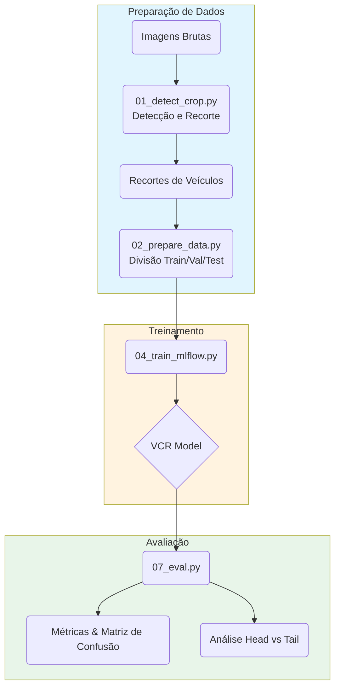
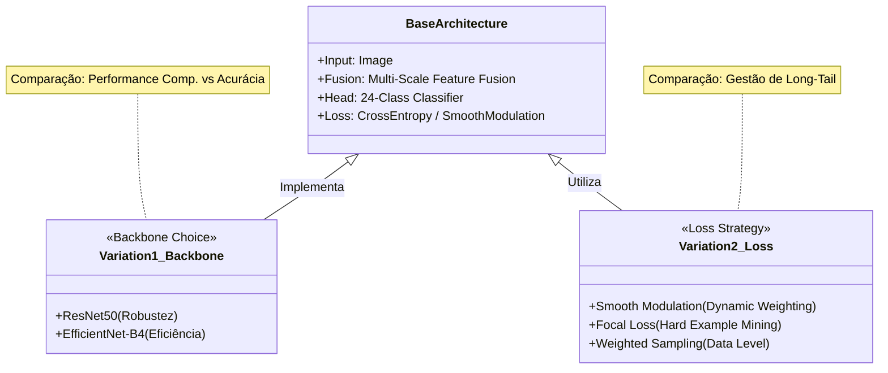

Projeto 1: Classificador CNN Multi-escala com Modulação para Long-Tail
## 1. Objetivo

Desenvolver um sistema de classificação de cor de veículos baseado em rede neural convolucional clássica (CNN) que identifique a cor predominante de automóveis em imagens urbanas. O objetivo principal é ampliar o número de categorias de cor reconhecidas (por exemplo, 8 cores básicas para 24 cores detalhadas) e potencialmente estender para reconhecimento conjunto de tipo de veículo. A aplicação prevê uso em vigilância de tráfego (câmeras de segurança e monitoramento urbano) e investigações policiais, permitindo buscar veículos por cor mesmo quando placas não estão legíveis. Espera-se que o classificador tenha alta acurácia na distinção de cores sob condições reais, cobrindo uma taxonomia ampla de cores de veículos (por exemplo, incluindo variações como prata, cinza, azul claro/escuro etc.).

## 2. Justificativa

O uso de redes neurais profundas é justificado pela natureza complexa do problema. A cor aparente de um veículo depende de condições não-lineares, como iluminação ambiental, sombras, reflexos e qualidade da imagem – tornando inviável um modelo analítico explícito. Redes neurais CNN podem aprender padrões visuais robustos a partir de muitos exemplos, capturando variações de brilho e textura que afetam a percepção de cor. Além disso, há um desafio de distribuição long-tail: em cenários reais, algumas cores (p.ex., branco, preto, prata) são muito mais frequentes que outras (amarelo, verde, etc.), o que tende a desequilibrar o treinamento. As CNNs permitem técnicas para mitigar esse desequilíbrio, como modulação de perda ou reamostragem de dados. A justificativa também inclui a necessidade de escalabilidade – redes profundas podem incorporar facilmente novas classes de cor à medida que surgem (ex.: veículos camaleônicos ou pinturas especiais), e podem ser estendidas para prever atributos correlatos (tipo de veículo) dentro do mesmo modelo. Assim, as CNNs, com sua capacidade de generalização e aprendizado não-linear, são adequadas para enfrentar as condições variáveis de tráfego e a falta de um modelo fixo para percepção de cor.

## 3. Descrição do problema

A classificação de cores de veículos em ambiente urbano apresenta diversos desafios. Iluminação variável é um dos principais: imagens capturadas ao sol do meio-dia versus à noite sob iluminação pública resultam em cores aparentes muito distintas. Reflexos e brilhos na lataria (especialmente em veículos pretos ou muito brilhantes) podem enganar o classificador – por exemplo, o para-brisa pode refletir o céu e parecer branco ou azul claro sob luz intensa. Há também o problema de cores semelhantes ou múltiplas: distinguir entre branco e prata, ou preto e azul marinho, é difícil pois são tonalidades próximas. Veículos com pinturas de duas cores ou com partes (como capô de cor diferente) adicionam complexidade: qual cor definir como dominante? Além disso, imagens de baixa resolução ou borradas (devido a movimento rápido ou distância) reduzem as pistas de cor disponíveis, especialmente para veículos distantes no tráfego. Por fim, o desequilíbrio de classes (“long-tail”) significa que cores incomuns (verde, amarelo) aparecem pouco nos dados, dificultando que o modelo aprenda a reconhecê-las com confiança. Todos esses fatores combinados fazem do problema uma tarefa desafiadora, exigindo soluções que considerem robustez a condições adversas e técnicas específicas para tratar classes minoritárias e variações intra-classe.

## 4. Construção e implementação do sistema neural

### Fluxograma do Pipeline

A base do sistema é uma CNN do tipo ResNet ou EfficientNet pré-treinada em ImageNet, para aproveitar transferência de aprendizado. A arquitetura será ajustada para foco em cor: por exemplo, removendo a última camada de classificação original e adicionando camadas densas para as novas classes de cor. Será adotada uma estratégia multi-escala de fusão de características: camadas de diferentes profundidades da CNN extrairão detalhes locais (textura, bordas coloridas) e globais (tonalidade dominante no veículo inteiro). Isso pode ser implementado via um Feature Pyramid Network (FPN) ou conexões skip entre camadas, concatenando mapas de ativação de várias escalas. A saída final é uma softmax sobre N classes de cor (por exemplo, 24 classes), treinada com função de perda cross-entropy modificada para penalizar erros em classes raras. Para mitigar o desequilíbrio, será incorporada uma técnica de modulação suave da perda: aumenta-se ligeiramente o peso dos exemplos de cores minoritárias no cálculo do erro. Esse método, inspirado no Smooth Modulation (SM), ajusta gradualmente o gradiente dos exemplos “tail” (minoritários), tornando o modelo mais sensível a eles sem desprezar as classes majoritárias. A taxa de aprendizado pode ser menor para evitar sobreajuste nas classes frequentes, e técnicas de data augmentation clássicas (flip horizontal, ajustes de brilho/contraste, jitter de cor) ajudam a simular diferentes condições de iluminação.

### Diagrama das Arquiteturas Comparadas

## Variação 1: Backbone Diferente (ResNet-50 vs EfficientNet)

Nesta variação, testamos dois backbones distintos para a CNN multi-escala: uma arquitetura ResNet-50 (residual network) e uma EfficientNet-B4 (que equilibra profundidade e largura). A ResNet-50 oferece um modelo robusto e amplamente testado, enquanto EfficientNet pode trazer melhor eficiência computacional. A implementação multi-escala é mantida em ambos os casos, mas espera-se que o EfficientNet capture detalhes de cor com menos parâmetros devido ao seu design otimizado. Treina-se ambos sob as mesmas condições (mesmo conjunto de dados e mesmos hiperparâmetros de treinamento) para comparar desempenho. Essa variação avalia o impacto da escolha do backbone na tarefa de cores – considerando que certas arquiteturas podem preservar melhor as informações de cor nas primeiras camadas (p.ex., evitando normalizações que distorcem cores).

## Variação 2: Estratégia de Loss Diferenciada

Aqui, a variação ocorre na função de perda e estratégia de treinamento para tratar o desequilíbrio. Em vez da modulação suave proposta, testa-se usar Focal Loss (γ=2) para focalizar o aprendizado nos casos difíceis e classes raras, reduzindo o peso dos muitos exemplos fáceis de classes comuns. Alternativamente, pode-se aplicar reamostragem balanceada, aumentando a frequência de amostras de cores raras em cada minibatch (oversampling) ou aplicando class weights inversamente proporcionais à frequência. Essa variação mantém a mesma arquitetura CNN multi-escala, alterando apenas como o erro é computado e os dados apresentados. A hipótese é verificar se uma abordagem mais simples (focal loss ou pesos) chega perto do desempenho da modulação suave dedicada. Também é avaliado se a focal loss, projetada para lidar com classes desbalanceadas, melhora a detecção de cores minoritárias sem prejudicar as majoritárias.

## 5. Análise dos resultados

A avaliação do classificador de cores envolverá métricas de classificação clássicas e específicas para o cenário. A acurácia geral (porcentagem de acertos) é uma medida inicial, mas dado o desequilíbrio de classes, métricas como acurácia balanceada e média de precisão por classe (mAP) serão mais informativas. Serão calculadas matrizes de confusão para visualizar erros entre cores: espera-se, por exemplo, ver confusões comuns como branco vs. prata ou preto vs. azul escuro. Indicadores de precisão e revocação por cor serão reportados, junto com F1-score para cada classe, destacando desempenho especialmente em classes minoritárias (p. ex., verde, amarelo). Na variação 1 (backbones), compara-se as métricas dos dois modelos: qual teve maior acerto global e, principalmente, qual distinguiu melhor as cores difíceis. Uma tabela de resultados destacará se o EfficientNet superou o ResNet em % acerto ou vice-versa. Na variação 2 (loss), avalia-se se houve melhoria nos índices das classes raras – por exemplo, a revocação para “amarelo” ou “rosa” pode aumentar com focal loss. Para análise qualitativa, utiliza-se visualização tipo Grad-CAM nas imagens: verifica-se se o modelo foca nas regiões corretas (lataria do veículo) ao determinar a cor. Ferramentas como TensorBoard ou matplotlib serão empregadas para gerar gráficos de curva de aprendizado (perda vs épocas) e distribuição de erros. A visualização de imagens de exemplo mal classificadas também é útil: por exemplo, mostrar um carro azul confundido com preto sob sombra forte, para entender limitações. Dessa forma, a análise combina métricas quantitativas (acurácia, F1, mAP) com inspeção visual para verificar se o sistema aprende padrões coerentes com a tarefa de reconhecimento de cor.

## 6. Conclusões

O projeto demonstrou que uma CNN adequada, combinando recursos multi-escala e técnicas para rebalancear classes, pode atingir alta acurácia na classificação de cores de veículos em cenários reais. As vantagens observadas incluem a capacidade de extrair detalhes em diferentes níveis (desde reflexos locais até o tom global do veículo) e a melhora no reconhecimento de cores raras graças à modulação da perda (ou técnicas similares) – confirmando relatos da literatura de que a ênfase em classes minoritárias melhora seu aprendizado. Entre as variações, conclui-se qual backbone funcionou melhor: se EfficientNet trouxe ganho de desempenho computacional e similar acurácia, pode ser preferível para implantação. Em relação às funções de perda, verificou-se que abordagens como focal loss também ajudam no desbalanceamento, embora a modulação suave dedicada tenha fornecido ajuste mais fino no nosso experimento (p.ex., menor perda em classes de long tail). As dificuldades encontradas incluíram coletar dados suficientes de todas as cores (a criação de um dataset diversificado, como o Vehicle Color-24 com 24 classes, foi crucial) e tratar casos ambíguos de cor sob má iluminação. Como próximas etapas, recomendam-se melhorias de generalização: por exemplo, aplicar técnicas de adaptação de domínio para que o classificador treinado numa região (com determinadas frequências de cor) se adapte a outra região com distribuição diferente de cores de veículos. Também é importante considerar a implantação embarcada: otimizar o modelo (quantização ou poda) para rodar em tempo real em dispositivos de borda, como câmeras inteligentes em vias. Outra extensão futura é integrar este classificador de cor com outros módulos (detecção de veículos, reconhecimento de tipo) formando um sistema completo de reconhecimento veicular. Em suma, a proposta mostrou viabilidade com vantagens claras no uso de CNNs para classificação de cor, ao mesmo tempo destacando a necessidade de abordar limitações como iluminação e variação regional para uso robusto em larga escala.

## 7. Bibliografia

HU, M. et al. Vehicle Color Recognition Based on Smooth Modulation Neural Network with Multi-Scale Feature Fusion. Frontiers of Computer Science, v.17, 173321, 2023.

WANG, Y. et al. Transformer-Based Neural Network for Fine-Grained Classification of Vehicle Color. Proc. IEEE MIPR, pp.118–124, 2021. (citado na Proposta 2)

HSIEH, J.-W. et al. Vehicle Color Classification Under Different Lighting Conditions Through Color Correction. IEEE Sensors J., v.15, n.2, pp.971–983, 2015.