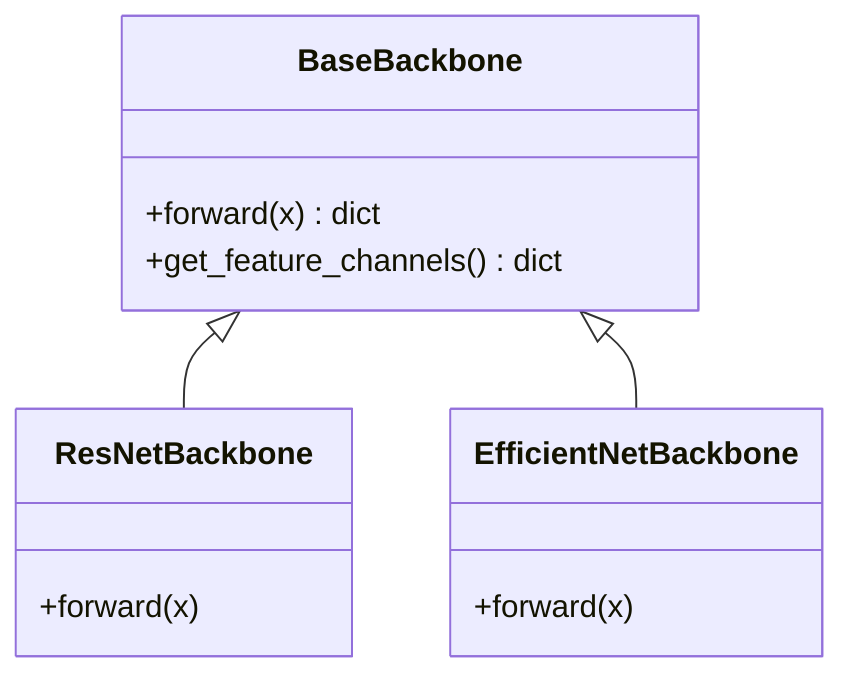

# Backbones

## 📖 Overview
The **Backbones** module provides CNN-based feature extractors that transform raw images into high-level semantic vector representations. These are the foundation of the VCR model, initialized with weights pre-trained on ImageNet to leverage transfer learning.

## 🏗️ Architecture / Design
Backbones are interchangeable components that follow a standard interface. They output a dictionary of feature maps (FPN-style) or a global feature vector.



## 🔑 Key Components

### `ResNetBackbone`
Classic Residual Networks (ResNet18, 34, 50).
- **ResNet50**: Recommended default for balance of speed and accuracy.
- **Output**: Features `{"c2", "c3", "c4", "c5"}` (if return_nodes=True) or global pool.

### `EfficientNetBackbone`
EfficientNet family (B0-B7) via `timm` library.
- **Config**: `efficientnet_b0`, `efficientnet_b4`, etc.

## 💻 Usage Examples

### Using Factory
```python
import torch
from src.core import BackboneFactory

# Create backbone
backbone = BackboneFactory.create("resnet50", {"pretrained": True})

# Forward pass
dummy_input = torch.randn(1, 3, 224, 224)
features = backbone(dummy_input)

# Check output channels (e.g., 2048 for ResNet50)
print(backbone.get_feature_channels())
```

### Direct Instantiation
```python
from src.backbones import ResNetBackbone

backbone = ResNetBackbone("resnet50", pretrained=True)
features = backbone(dummy_input)
```

## ⚙️ Configuration
In `config.yaml`:

```yaml
train:
  backbone: "resnet50"  # or "efficientnet_b0"
```
In `hyperparameters.yaml` (for optimization):
```yaml
backbone:
  type: "categorical"
  choices: ["resnet18", "resnet50", "efficientnet_b0"]
```
