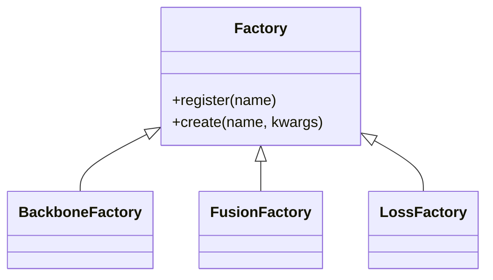

# Core

## 📖 Overview
The **Core** module provides the fundamental building blocks for the VCR project, including abstract base classes and the Factory pattern implementation that allows for dynamic component creation (Backbones, Fusion, Losses, Detectors).

## 🏗️ Architecture / Design
- **Interchangeable Components**: Defined via abstract base classes (`BaseBackbone`, `BaseLoss`, `BaseTrainingStrategy`, etc.).
- **Factories**: Centralized creation logic (`BackboneFactory`, `LossFactory`, `StrategyFactory`) to instantiate components from string names in the configuration strings without hardcoded `if/else` logic.

### Factory Pattern
We use a centralized Factory + Registry pattern to instantiate components from configuration strings without hardcoded `if/else` logic.



## 🔑 Key Components

### `BaseFactory`
Generic factory class that manages a registry of implementations.

### `BackboneBase`, `FusionBase`, `LossBase`, `DetectorBase`
Abstract base classes defining the interface for each component type.

### `StrategyFactory`
Creates training strategies (e.g., `"vcr"`).

## 💻 Usage Examples

### Registering a New Component
```python
from src.core import BackboneFactory, BackboneBase

@BackboneFactory.register("my_custom_backbone")
class MyBackbone(BackboneBase):
    def __init__(self, **kwargs):
        super().__init__()
        # ...
```

### Instantiating via Factory
```python
from src.core import BackboneFactory

# Config-driven instantiation
model_name = "my_custom_backbone"
model = BackboneFactory.create(model_name, pretrained=True)
```

## ⚙️ Configuration
The core module itself isn't configured, but it enables the configuration of other modules:

```yaml
model:
  backbone: "resnet50"  # This string is passed to BackboneFactory.create()
```
