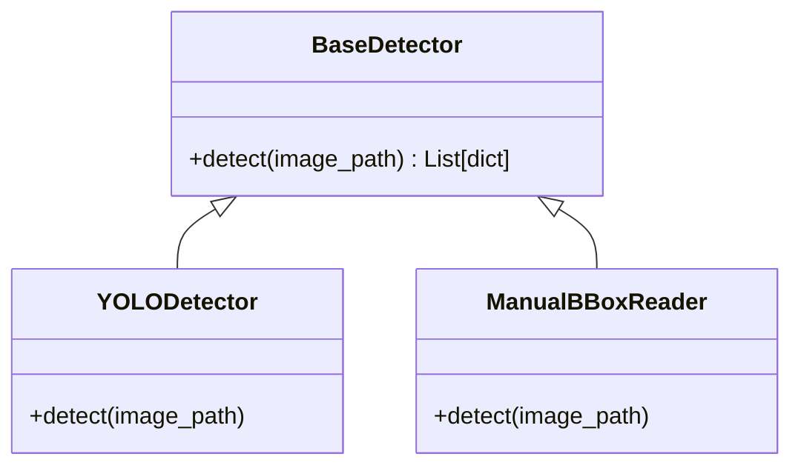

# Detectors

## 📖 Overview
The **Detectors** module abstracts the vehicle detection strategy, allowing the pipeline to switch between different detection methods (e.g., YOLO, Manual/Ground Truth) uniformly. It is primarily used by `01_detect_crop.py`.

## 🏗️ Architecture / Design
This module follows the **Strategy Pattern**. The base class `BaseDetector` defines the contract, and concrete implementations handle specific detection logic.



## 🔑 Key Components

### `BaseDetector`
Abstract base class defining the interface.

### `YOLODetector`
Uses Ultralytics YOLO (e.g., YOLO11) to detect vehicles.
- **Input**: Image path
- **Output**: List of `{'bbox': [x1, y1, x2, y2], 'confidence': float, 'class_id': int}`

### `ManualBBoxReader`
Reads existing bounding boxes from a CSV or proprietary format (e.g., PRF data). primarily used when ground truth detections are available.

## 💻 Usage Examples

### Using YOLO Detector
```python
from src.detectors import YOLODetector

# Initialize
detector = YOLODetector(model_path="yolo11x.pt", confidence=0.5)

# Detect
detections = detector.detect("data/raw/image.jpg")
for det in detections:
    print(det['bbox'], det['confidence'])
```

### Using Factory
```python
from src.core import DetectorFactory

detector = DetectorFactory.create("yolo", {"model_path": "yolo11x.pt"})
```

## ⚙️ Configuration
In `config.yaml`:

```yaml
detector:
  name: "yolo"  # or "manual"
  params:
    model_path: "yolo11n.pt"
    confidence: 0.5
    device: "cuda"
```
