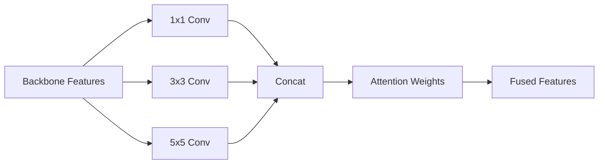

# Fusion

## 📖 Overview
The **Fusion** module combines visual features extracted by the backbone before final classification. It is critical for capturing multi-scale details (fine textures vs. global shape) which are essential for color recognition.

## 🏗️ Architecture / Theory
Fusion modules take high-level features from the backbone and refine them.

### MSFF (Multi-Scale Feature Fusion)
Processes features at multiple receptive fields (1x1, 3x3, 5x5) and combines them using an attention mechanism to weigh the importance of each scale dynamically.



## 🔑 Key Components

### `MSFF`
Multi-Scale Feature Fusion. Recommended default.
- **Input**: Channels from backbone (e.g., 2048)
- **Output**: Fused feature vector (e.g., 512)

### `SimpleConcat`
Baseline fusion that concatenates features from different backbone layers.
- **Pros**: Faster training
- **Cons**: Less accurate than MSFF

## 💻 Usage Examples

### Using Factory
```python
import torch
from src.core import FusionFactory

# Create fusion module
fusion = FusionFactory.create("msff", {"in_channels": 2048, "out_channels": 512})

# Forward pass
dummy_features = torch.randn(2, 2048, 7, 7)  # Batch=2
output = fusion(dummy_features)
print(output.shape)  # torch.Size([2, 512])
```

## ⚙️ Configuration
In `config.yaml`:

```yaml
train:
  fusion: "msff"  # or "simple_concat"
```

In `hyperparameters.yaml`:
```yaml
fusion:
  type: "categorical"
  choices: ["msff", "simple_concat"]
```
