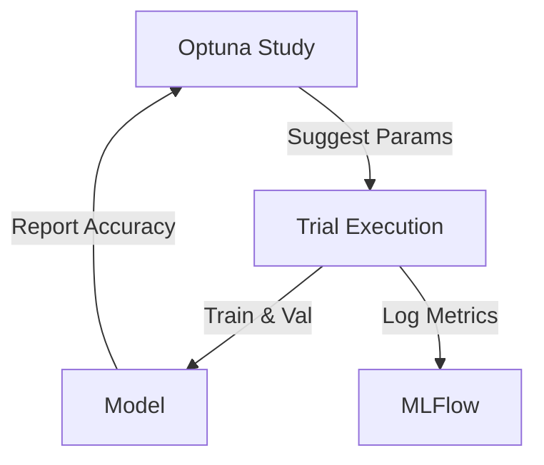

# Optimization

## 📖 Overview
The **Optimization** module integrates **Optuna** with **MLFlow** to automate hyperparameter tuning. It uses Bayesian optimization (TPE) to efficiently search for the best model configuration (Learning Rate, Backbone, Batch Size, etc.) instead of random guessing.

## 🏗️ Architecture / Design

### Optuna + MLFlow Integration
We run an Optuna **Study** where each **Trial** corresponds to a full training run.
- **Optuna**: Suggests hyperparameters based on previous results.
- **MLFlow**: Tracks every trial as a nested run, logging parameters and metrics.



## 🔑 Key Components

### `run_optimization`
Main entry point that manages the study lifecycle.

### `OptunaMLFlowCallback`
Syncs Optuna trials with MLFlow runs.

## 💻 Usage Examples

### Running Optimization
```bash
# Run with default config (hyperparameters.yaml)
python 05_optimize.py

# Custom configuration
python 05_optimize.py --hp-config my_search.yaml --n-trials 100
```

### Viewing Results
```bash
mlflow ui
# Go to "VCR-Optimization" experiment to compare runs.
```

## ⚙️ Configuration
In `hyperparameters.yaml`:

```yaml
hyperparameters:
  lr:
    type: "float"
    low: 1.0e-5
    high: 1.0e-3
    log: true
  backbone:
    type: "categorical"
    choices: ["resnet18", "resnet50"]

fixed:
  epochs: 20  # Use fewer epochs for faster search
```
