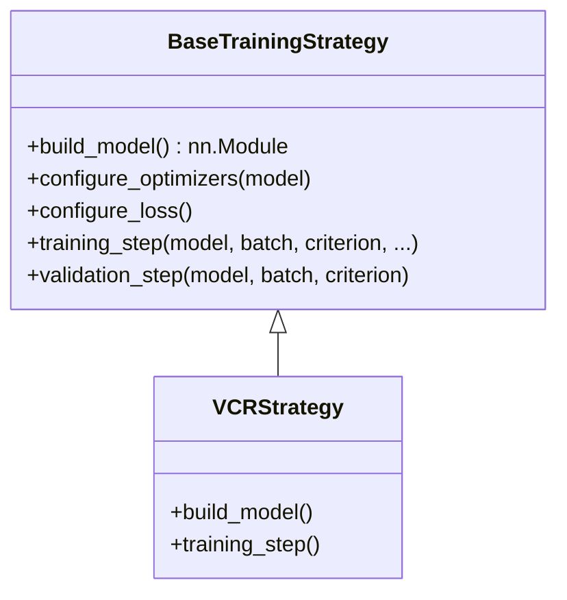

# Strategies

## 📖 Overview
The **Strategies** module implements different training recipes and model architectures using the Strategy Pattern. This decouples the training loop in `04_train_mlflow.py` from specific implementation details, allowing for flexible experimentation with different approaches (e.g., standard VCR, Contrastive Learning, Knowledge Distillation) without modifying the runner script.

## 🏗️ Architecture
All strategies must implement the `BaseTrainingStrategy` interface defined in `src/core/interfaces.py`.



## 🔑 Key Components

### `VCRStrategy` (`src/strategies/vcr.py`)
The default strategy for Vehicle Color Recognition.
- **Model**: Uses `VCRModel` (Backbone + MSFF + Classification Head).
- **Loss**: configurable (default: `SmoothModulationLoss`).
- **Optimizer**: AdamW + CosineAnnealingLR.
- **Training**: Standard supervised learning with class-weighted sampling.

## 💻 Usage Examples

### in `config.yaml`
Select the strategy to use during training.

```yaml
train:
  strategy: "vcr"
  # Strategy-specific params
  backbone: "resnet50"
  fusion: "msff"
```

### Implementing a New Strategy
Create a new file `src/strategies/my_strategy.py`:

```python
from src.core.interfaces import BaseTrainingStrategy
from src.core.factories import StrategyFactory

class MyStrategy(BaseTrainingStrategy):
    def build_model(self):
        return MyCustomModel(...)
    
    def training_step(self, model, batch, criterion, ...):
        # Custom logic
        pass

# Register it
StrategyFactory.register("my_strategy", MyStrategy)
```
